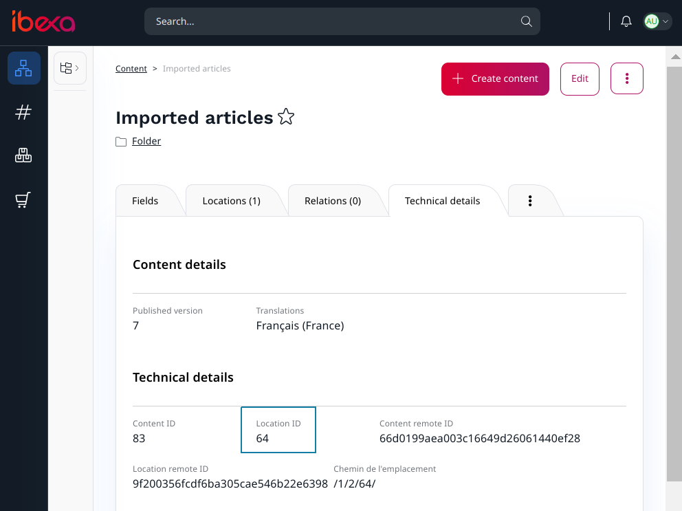
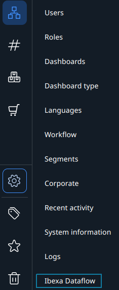
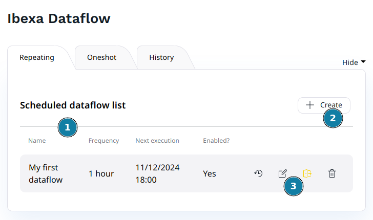
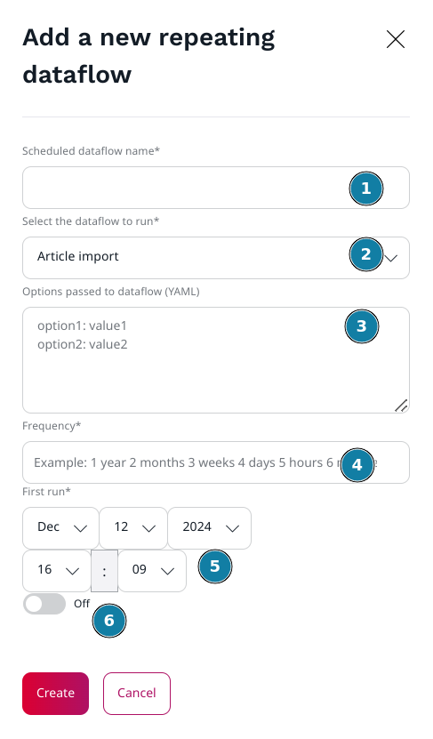
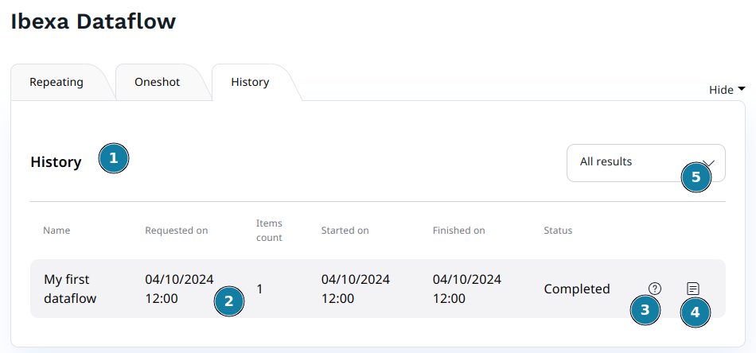
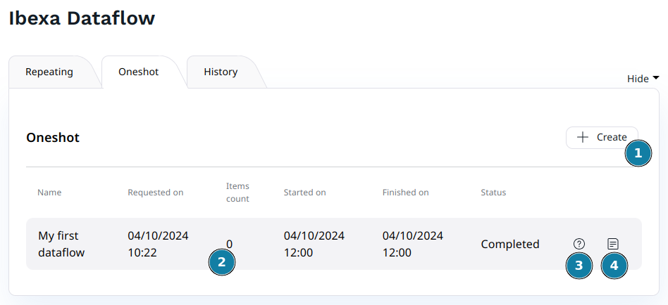
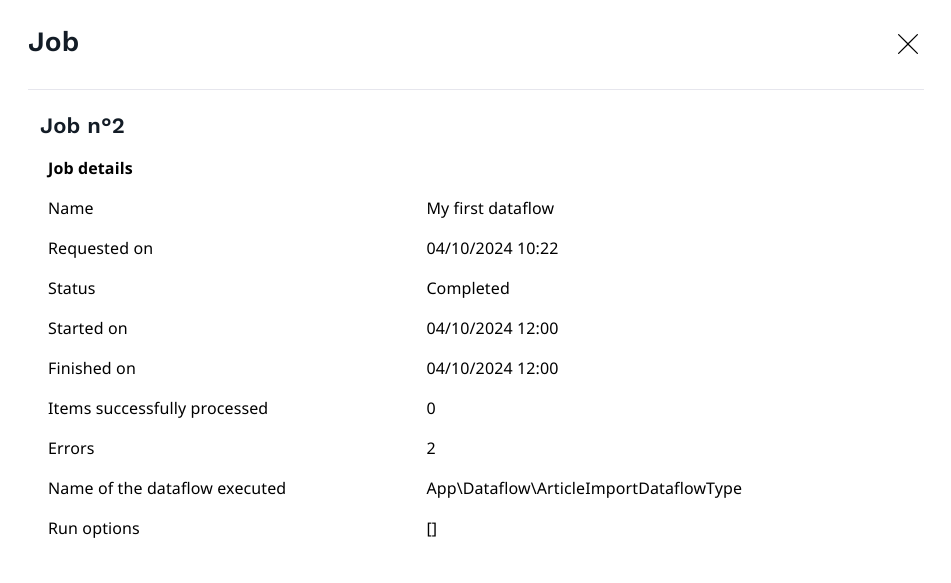
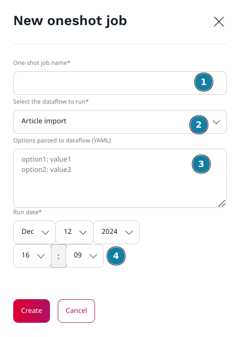

# Code Rhapsodie Ibexa Dataflow Bundle

Ibexa DataflowBundle is a bundle
integrating [Code Rhapsodie Dataflow bundle](https://github.com/code-rhapsodie/dataflow-bundle) into Ibexa 4.0+.
Dataflows can be piloted from an interface integrated into the Ibexa backoffice.
Ibexa Dataflow bundle is intended to manage content imports from external data sources.

> Note: before using this bundle, please read
> the [Code Rhapsodie Dataflow bundle documentation](https://github.com/code-rhapsodie/dataflow-bundle/blob/master/README.md).

> Command line notice: When you use Dataflow commands, **use `--siteaccess` instead of `--connection`** except
> for `code-rhapsodie:dataflow:dump-schema` command.

| Ibexa Dataflow Version | Ibexa Content Version | Status                        |
|------------------------|-----------------------|-------------------------------|
| 6.x                    | 5.x                   | :white_check_mark: Maintained |

## User Interface (UI)

The UI lets you create workflow processes from any defined `DataflowTypes`, and set options to each.

Processes can be set to run either:

- only once, at a given date and time
- regularly, by defining the first run date and time, and the interval between subsequent runs

## Installation

### Step 1: Install the bundle via composer

```shell script
$ composer require code-rhapsodie/ibexa-dataflow-bundle
```

### Step 2: Enable the bundle

> Note: The loading order between the Dataflow bundle and Ibexa Dataflow bundle is important. Dataflow must be loaded
> first.

Add those two lines in the `config/bundles.php` file:

```php
<?php

return [
     // ...
    CodeRhapsodie\DataflowBundle\CodeRhapsodieDataflowBundle::class => ['all' => true],
    CodeRhapsodie\IbexaDataflowBundle\CodeRhapsodieIbexaDataflowBundle::class => ['all' => true],
    // ...
];
```

### Step 3: Import bundle routing file

```yaml
# config/routing/ibexa_dataflow.yaml

_cr.ibexa_dataflow:
  resource: '@CodeRhapsodieIbexaDataflowBundle/Resources/config/routing.yaml'
```

### Step 4: Update the database schema

Please refer to
the [Code-Rhapsodie Dataflow Bundle installation guide](https://github.com/code-rhapsodie/dataflow-bundle#update-the-database).

### Step 5: Schedule the job runner

Please refer to
the [Code-Rhapsodie Dataflow Bundle Queue section](https://github.com/code-rhapsodie/dataflow-bundle#queue).

## Configuration

By default, the `ContentWriter` will publish contents using the `admin` user. If you want to use another user (with
sufficient permissions), you can configure it like this:

```yaml
# config/packages/code_rhapsodie_ibexa_dataflow.yaml

code_rhapsodie_ibexa_dataflow:
  # Integer values are assumed to be user ids, non-integer values are assumed to be user logins
  admin_login_or_id: webmaster
```

## Define your Dataflow

Before using the admin UI to manage your dataflows, you need to define them. Please refer
to [Code-Rhapsodie Dataflow type documentation](https://github.com/code-rhapsodie/dataflow-bundle#define-a-dataflow-type).

## Use the ContentWriter

To add or update Ibexa contents, you can use the `CodeRhapsodie\IbexaDataflowBundle\Writer\ContentWriter` writer.

### Step 1: Inject the dependencies and add the writer

Inject the `ContentWriter` service into the constructor of your DataflowType and add the content writer into the writer
list like this:

```php
// In your DataflowType

use CodeRhapsodie\IbexaDataflowBundle\Writer\ContentWriter;
use CodeRhapsodie\DataflowBundle\DataflowType\AbstractDataflowType;
[...]

class MyDataflowType extends AbstractDataflowType
{
    //[...]
    public function __construct(private readonly ContentWriter $contentWriter)
    {
    }
    //[...]
    protected function buildDataflow(DataflowBuilder $builder, array $options): void
    {
        //[...]
        $builder->addWriter($this->contentWriter);
    }
}
```

### Step 2: Add a step for prepare the content

To process Ibexa contents into your Dataflow, you need to transform the data into `ContentCreateStructure`
or `ContentUpdateStructure` objects.
in order to respectively create or update contents.

But, in order to determine if the content already exists or not, you first need to look up for it.

One way is to use the remote id to search for the content.

In the following example, the remote id pattern is `article-<id>` with the `<id>` replaced by the data id provided by
the reader.
To check if the content exists or not, I use the service `ContentService` provided by Ibexa.

The step is added as an anonymous function and has 3 types of return values:

* When the step returns `false`, the data is dropped.
* When the step returns a `ContentCreateStructure`, the data will be saved into a new Ibexa content.
* When the step returns a `ContentUpdateStructure`, the existing Ibexa content will be updated by overwriting all
  defined fields in the data.

For the new content, you must provide one or more "parent location id" as the 3rd argument of
the `ContentCreateStructure` constructor.

In this example, I have added a new folder to store all articles.

To get the location id of the parent Ibexa content, go to the admin UI and select the future parent content, click on
the details tabs, and read the "Location id" like this:



> Note: the best practice is to define this parent id in your `parameters.yaml` file or your `.env.local` file for each
> execution environment.

```php
// In your DataflowType

use CodeRhapsodie\IbexaDataflowBundle\Factory\ContentStructureFactory;
use CodeRhapsodie\IbexaDataflowBundle\Writer\ContentWriter;
use CodeRhapsodie\DataflowBundle\DataflowType\AbstractDataflowType;
[...]

class MyDataflowType extends AbstractDataflowType
{
    //[...]
    public function __construct(
        private readonly ContentWriter $contentWriter,
        private readonly ContentStructureFactory $contentStructureFactory
    ) {
    }
    //[...]
    protected function buildDataflow(DataflowBuilder $builder, array $options): void
    {
        //[...]
        $builder->addStep(function ($data) {
            if (!isset($data['id'])) {
                return false;
            }

            $remoteId = sprintf('article-%d', $data['id']);
            unset($data['id']);

            return $this->contentStructureFactory->transform(
                $data,
                $remoteId,
                'eng-GB',
                'article2',
                54, //Parent location id
                ContentStructureFactoryInterface::MODE_INSERT_OR_UPDATE //Optional value. Other choice : ContentStructureFactoryInterface::MODE_INSERT_ONLY or ContentStructureFactoryInterface::MODE_UPDATE_ONLY
            );
        });
        // If you want the writer log
        $this->contentWriter->setLogger($this->logger);
        $builder->addWriter($this->contentWriter);
    }
}
```

This example uses `ContentStructureFactory` to check if the content exists and returns the adequate `ContentStrucure` to
pass to the content writer.

## Use the NotModifiedContentFilter

When updating contents, you might want to ignore contents where the update would not result in any actual changes in
fields values. In that case, you can add the `NotModifiedContentFilter` as one of your steps.

```php
// In your DataflowType
public function __construct(NotModifiedContentFilter $notModifiedContentFilter)
{
    $this->notModifiedContentFilter = $notModifiedContentFilter;
}

//[...]
protected function buildDataflow(DataflowBuilder $builder, array $options): void
{
    //[...]
    // If you want the filter log
    $this->notModifiedContentFilter->setLogger($this->logger);
    $builder->addStep($this->notModifiedContentFilter);
    //[...]
}
```

This filter compares each field value in the `ContentUpdateStructure` received to the fields values in the existing
content object. If all values are identical, this filter will return `false`, otherwise, the `ContentUpdateStructure`
will be returned as is.

Not all field types are supported by this filter. Il a field type is not supported, values will be assumed different. If
your dataflow is dealing with content types containing unsupported field types, it is better to simply not use
the `NotModifiedContentFilter` to prevent unnecessary overhead.

### Supported field types

- ibexa_author
- ibexa_boolean
- ibexa_country
- ibexa_datetime
- ibexa_date
- ibexa_email
- ibexa_float
- ibexa_integer
- ibexa_isbn
- ibexa_keyword
- ibexa_object_relation
- ibexa_object_relation_list
- ibexa_richtext
- ibexa_selection
- ibexa_text
- ibexa_string
- ibexa_time
- eztags
- ibexa_url
- novaseometas
- ibexa_matrix
- ibexa_gmap_location
- ibexa_taxonomy_entry_assignment
- ibexa_address
- ibexa_customer_group
- ibexa_product_specification
- ibexa_seo

### Add custom field comparator

If you want to add support for a field type, simply create your own comparator.

```php
<?php

use CodeRhapsodie\IbexaDataflowBundle\Core\FieldComparator\AbstractFieldComparator;
use Ibexa\Core\FieldType\Value;
//[...]

class MyFieldComparator extends AbstractFieldComparator
{
    //[...]
    protected function compareValues(Value $currentValue, Value $newValue): bool
    {
        // Return true if values are identical, false if values are different.
    }
}

```

```yaml
# Service declaration
App\FieldComparator\MyFieldComparator:
  parent: 'CodeRhapsodie\IbexaDataflowBundle\Core\FieldComparator\AbstractFieldComparator'
  tags:
    - { name: 'coderhapsodie.ibexa_dataflow.field_comparator', fieldType: 'my_field_type_identifier' }
```

## Product attributes and `NotModifiedProductFilter`

`NotModifiedProductFilter` skips the update of a product when its content fields and its attributes are unchanged
(`ProductUpdateStructure::setUpdateContent(false)`). Content fields are compared with the field comparators above.
Attributes are compared by a `ProductAttributesComparatorInterface` service.

The default implementation, `ApiProductAttributesComparator`, loads the product through the public
`Ibexa\Contracts\ProductCatalog\ProductServiceInterface` and compares each imported attribute with the stored one.
An attribute that is missing or has no value on the stored product is always considered modified. The comparison
depends on the attribute type:

| Attribute type | Comparison |
|----------------|------------|
| `datetime` | Same instant. Values can be `DateTimeInterface` or strings, time zones are ignored. |
| `measurement` | Same value (or min/max for ranges) and same unit. Handled by duck typing, `ibexa/measurement` is not required. |
| anything else (`checkbox`, `integer`, `float`, `color`, `selection`, `symbol`...) | Same scalar value. The PHP type is ignored (`3`, `3.0` and `'3'` are equal). |

When in doubt (unknown object, unexpected format), the attribute is considered modified: the worst case is an
unnecessary update. Without `ibexa/product-catalog`, attributes never trigger an update.

### Add a custom attribute value comparator

To handle an attribute type (for example one added by a third party package), implement
`ProductAttributeValueComparatorInterface` and tag the service. The first comparator that supports the type is used.

```php
<?php

use CodeRhapsodie\IbexaDataflowBundle\Filter\ProductAttributeValueComparatorInterface;

class MyAttributeValueComparator implements ProductAttributeValueComparatorInterface
{
    public function supports(string $attributeType): bool
    {
        return $attributeType === 'my_attribute_type';
    }

    public function isSame(mixed $stored, mixed $expected): bool
    {
        // Return true if values are identical, false if values are different (or if unsure).
    }
}
```

```yaml
# Service declaration
App\AttributeComparator\MyAttributeValueComparator:
  tags:
    - { name: 'coderhapsodie.ibexa_dataflow.product_attribute_value_comparator' }
```

### Replace the attribute comparator

Loading each product through the API can be slow on large catalogs. You can replace the whole strategy (for example
with a single SQL query) by implementing `ProductAttributesComparatorInterface` and overriding the alias:

```yaml
CodeRhapsodie\IbexaDataflowBundle\Filter\ProductAttributesComparatorInterface: '@App\Dataflow\MyProductAttributesComparator'
```

# Admin UI

## Access to the Ibexa Dataflow UI

You can access the Ibexa Dataflow administration UI from your Ibexa admin back-office.



1. Click to "Admin"
1. Click to "Ibexa Dataflow"

## Scheduled dataflow list

When you access to the Ibexa Dataflow administration UI, you arrive on the scheduled dataflow list page:



1. Scheduled dataflow list
1. Button to add a new scheduled dataflow
1. Tools available for each scheduled dataflow. In order from left to right :
    1. Display the history for this dataflow schedule
    1. Edit this dataflow schedule
    1. Enable/Disable this dataflow schedule
    1. Delete this dataflow schedule

> Note: You can define more than one schedule for any given dataflow.

## Add a new schedule

Go to the Ibexa Dataflow admin, and click on the "+" orange button.

In the new popin, fill in the fields:



1. Type the Dataflow schedule name
1. Select the Dataflow type. The list is automatically generated from the list of Symfony services with the
   tags `coderhapsodie.dataflow.type`. If your dataflow type is not
   present, [check the configuration](https://github.com/code-rhapsodie/dataflow-bundle#check-if-your-dataflowtype-is-ready)
1. Type here the Dataflow options. Basic expected format: one option per line and option name and value separated
   with `: `. For more complex options, the whole YAML format is supported.
1. Type here the frequency. The value must be compatible with the the
   PHP [strtotime](https://www.php.net/manual/en/function.strtotime.php) function.
1. Choose the date and time of the first job.
1. Check if you want to run this Dataflow.

Finally, click on the "Create" button.

## Read the history

When you click on the "History" tab in the Ibexa Dataflow admin UI, the job history for all Dataflow configured and
executed is displayed.



1. The history list
1. A summary of each job dates and number of items processed.
1. Click on the question mark icon to display the job details.
1. Click on the text icon to display the job exception log.
1. Switch between displaying all jobs, or only non-empty jobs (at least 1 item was processed)

Details of one scheduled job:


### Job details popin

The job popin has two tabs: "Information" (dates, counters, options) and "Log". Switching between them does not close
the popin, and a loaded tab is kept in memory until the page is reloaded. If the log is empty, a message says so.

When the popin is opened from the execution history of a scheduled dataflow (the popin of the "Recurring" tab), a
"Back to the executions history" button brings you back to that history.

### Link directly to a job

Add the `job` query parameter to the Ibexa Dataflow admin URL to open the details popin of a job on page load:

```
https://your-domain/admin/ibexa_dataflow/?job=<job id>
```

The parameter is removed from the URL once the popin is open, so reloading the page does not open it again. It only
accepts a numeric job id.

This is useful to link to a job from an Ibexa back office notification. With the `system` notification type, pass the
parameter in `route_params`:

```php
$createStruct = new \Ibexa\Contracts\Core\Repository\Values\Notification\CreateStruct();
$createStruct->ownerId = $userId;
$createStruct->type = 'system';
$createStruct->data = [
    'icon' => 'alert-error',
    'subject' => 'Dataflow failed',
    'content' => sprintf('Job "%s" (#%d) ended with errors.', $job->getLabel(), $job->getId()),
    'route_name' => 'coderhapsodie.ibexa_dataflow.main',
    'route_params' => ['job' => $job->getId()],
];
$notificationService->createNotification($createStruct);
```

Clicking the notification then opens the job details directly.

## One-shot job

If you don't want to run a Dataflow periodically, you can add a single execution at the time and date that you want.

Go to the Ibexa Dataflow admin UI and click on the "Oneshot" tab.



1. This button allows you to create a new one-shot job (see below).
1. A summary of each job dates and number of items processed.
1. Click on the question mark icon to display the job details.
1. Click on the text icon to display the job exception log.

Details of one-shot job:



Here the job has fail.

## Add a one-shot job

Go to the Ibexa Dataflow admin UI and click on the "Oneshot" tab. Click on the "+ Create" button to open the add popin.



1. Type the Dataflow job name
1. Select the Dataflow type. The list is automatically generated from the list of Symfony services with the
   tags `coderhapsodie.dataflow.type`. If your dataflow type is not
   present, [check the configuration](https://github.com/code-rhapsodie/dataflow-bundle#check-if-your-dataflowtype-is-ready)
1. Type here the Dataflow options. Basic expected format: one option per line and option name and value separated
   with `: `. For more complex options, the whole YAML format is supported.
1. Choose the date and time of the first job.

Finally, click on the "Create" button.

# Rights

If a non-administrator user needs read-only access to the dataflow interface, add the `Setup / Administrate`
and `Ibexa Dataflow / View` policies in one of their roles.

# Issues and feature requests

Please report issues and request features at https://github.com/code-rhapsodie/ibexa-dataflow-bundle/issues.

# Contributing

Contributions are very welcome. Please see [CONTRIBUTING.md](CONTRIBUTING.md) for
details. Thanks
to [everyone who has contributed](https://github.com/code-rhapsodie/ibexa-dataflow-bundle/graphs/contributors)
already.

# License

This package is licensed under the [MIT license](LICENSE).
